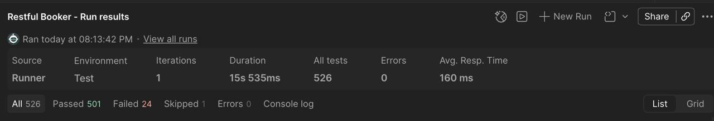

# Restful Booker — тестирование REST API

Учебно-практический проект по функциональному тестированию публичного API [Restful Booker](https://restful-booker.herokuapp.com/apidoc/index.html).

Покрыты все операции из документации, применены техники тест-дизайна, проверки автоматизированы в Postman и запускаются из консоли через Newman. По результатам прогонов найдено и задокументировано **5 дефектов бэкенда**, включая два необработанных исключения `500 Internal Server Error`.

📄 **[Отчёт о найденных дефектах](docs/BUGS.md)**



[](https://github.com/kotysheff/restful-booker-api-tests/actions/workflows/api-tests.yml)

📊 [Живой отчёт о последнем прогоне](https://kotysheff.github.io/restful-booker-api-tests/)

---

## Результаты

| Метрика | Значение |
|---|---|
| Операций API покрыто | 8 из 8 |
| Запросов в коллекции | 67 |
| Проверок за прогон | ~525 |
| Найдено дефектов | 5 |
| Время полного прогона | ~15 секунд |

## Найденные дефекты

| ID | Severity | Заголовок | Эндпоинт | Issue |
|----|----------|-----------|----------|-------|
| [BUG-01](docs/BUGS.md#bug-01) | Major | Фильтр по `checkin` не возвращает созданную бронь | `GET /booking` | [#1](https://github.com/kotysheff/restful-booker-api-tests/issues/1) |
| [BUG-02](docs/BUGS.md#bug-02) | Major | `500 Internal Server Error` при невалидном формате даты в query | `GET /booking` | [#2](https://github.com/kotysheff/restful-booker-api-tests/issues/2) |
| [BUG-03](docs/BUGS.md#bug-03) | Major | `500 Internal Server Error` при передаче числа в `firstname` | `PUT /booking/:id` | [#3](https://github.com/kotysheff/restful-booker-api-tests/issues/3) | 
| [BUG-04](docs/BUGS.md#bug-04) | Major | Отсутствует валидация тела запроса при обновлении брони | `PUT`, `PATCH /booking/:id` | [#4](https://github.com/kotysheff/restful-booker-api-tests/issues/4) | 
| [BUG-05](docs/BUGS.md#bug-05) | Medium | `405 Method Not Allowed` вместо `404 Not Found` при несуществующем ID | `PATCH`, `DELETE /booking/:id` | [#5](https://github.com/kotysheff/restful-booker-api-tests/issues/5) | 

Полные баг-репорты с предусловиями, шагами воспроизведения и ожидаемым результатом — в [docs/BUGS.md](docs/BUGS.md).

---

## Что покрыто

**Операции:** `POST /auth`, `GET /booking`, `GET /booking/:id`, `POST /booking`, `PUT /booking/:id`, `PATCH /booking/:id`, `DELETE /booking/:id`, `GET /ping`

**Техники тест-дизайна:**
- классы эквивалентности — валидные и невалидные значения для каждого поля
- анализ граничных значений — пустые строки, `null`, отрицательные числа, инверсия дат
- тестирование типов данных — строка вместо числа, число вместо строки, строка вместо boolean
- негативное тестирование авторизации — отсутствие токена, невалидный токен, невалидный Basic Auth
- проверка контракта ответа — состав полей, типы, полное совпадение ответа с телом запроса

**Уровни проверок в каждом тесте:** код ответа, статус-сообщение, заголовки, время ответа, структура и типы полей тела.

## Стек

| | |
|---|---|
| Инструменты | Postman, Newman, newman-reporter-htmlextra |
| Скрипты тестов | JavaScript (Chai assertions) |
| Генерация тест-данных | Python |
| CI | GitHub Actions |

## Подходы

**Data-Driven Testing.** Негативные сценарии для `POST /booking` вынесены в отдельный набор данных. Файл [`data/negative_postman_data.json`](data/negative_postman_data.json) генерируется скриптом [`scripts/generate_data.py`](scripts/generate_data.py) — 19 кейсов создаются программно вместо ручного дублирования запросов.

**Динамическая генерация кейсов в рантайме.** Для `PUT /booking/:id` набор из 18 негативных сценариев строится прямо в pre-request скрипте и прогоняется циклом через `postman.setNextRequest()`. Каждая итерация подставляет своё тело запроса, свою куку авторизации и своё ожидаемое значение кода ответа.

**Изоляция тестов.** Запросы на удаление создают собственную бронь в pre-request перед выполнением — тесты не зависят друг от друга и от порядка запуска.

**Устойчивость к времени.** Даты заезда и выезда вычисляются относительно текущей даты, а не зашиты константами.

---

## Структура репозитория

```
├── collection/     коллекция Postman и файл окружения
├── data/           тест-данные для data-driven прогона
├── docs/           баг-репорты и тест-кейсы
├── reports/        HTML-отчёты Newman
├── scripts/        генератор тест-данных на Python
└── .github/        workflow для CI
```

## Как запустить

### Требования

```bash
npm install -g newman newman-reporter-htmlextra
```

### Полный регрессионный прогон

```bash
newman run collection/RestfulBooker.postman_collection.json \
  -e collection/RestfulBooker.postman_environment.json \
  -r cli,htmlextra \
  --reporter-htmlextra-export reports/full-run.html \
  --reporter-htmlextra-darkTheme
```

### Data-driven набор для POST /booking

```bash
newman run collection/RestfulBooker.postman_collection.json \
  -e collection/RestfulBooker.postman_environment.json \
  --folder "Негативные тесты - DDT" \
  -d data/negative_postman_data.json \
  -r cli,htmlextra \
  --reporter-htmlextra-export reports/ddt-run.html
```

### Перегенерировать тест-данные

```bash
python3 scripts/generate_data.py
```

### Запуск из GUI

Импортировать в Postman оба файла из `collection/`, выбрать окружение `Test` и запустить коллекцию через Runner.

---

## Почему часть тестов падает

**Падающие проверки — это найденные дефекты, а не сломанные тесты.**

Каждое падение в отчёте соответствует записи в [docs/BUGS.md](docs/BUGS.md). Тесты намеренно проверяют поведение, соответствующее спецификации, а не фактическое поведение API — иначе дефекты остались бы незамеченными.

Одна проверка помечена как пропущенная (`skip`): это data-driven запрос, который выполняется только при запуске с флагом `-d` и корректно пропускается в полном прогоне.

---

## Автор

**kotysheff** — [GitHub](https://github.com/kotysheff) · [Telegram](https://t.me/kotysheff)
